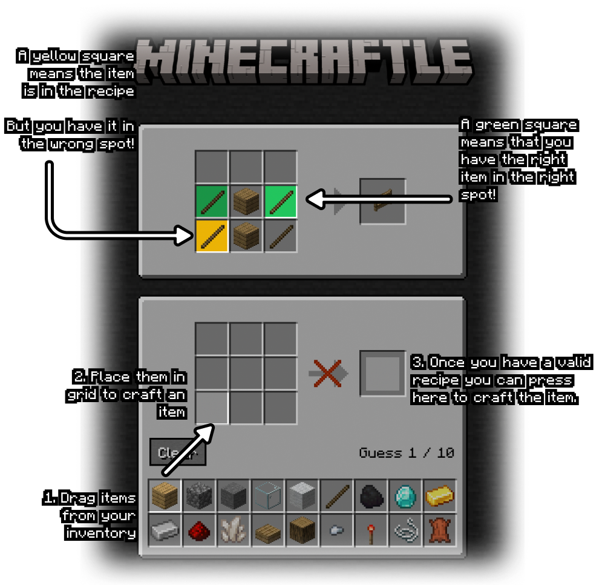

<div align="center">
  <a href="https://minecraftle2.vercel.app">
    
  </a>

  <h1>
    Wordle with a Minecraft spin.
  </h1>

[](https://discord.gg/5BJpzEmk)

</div>

> [!NOTE]  
> This project is essentially a fork of [`zachpmanson/minecraftle`](https://github.com/zachpmanson/minecraftle) with a complete refactor in place. All credit for the idea and crafting implementation should go to them!

[Minecraftle](https://minecraftle2.vercel.app) is a Wordle-like game with a Minecraft-like interface. You craft items in a 3x3 grid and try and guess what the item is in 10 guesses. 

Everytime you submit an answer your shown the items in their correct spots (marked in green), items that are apart of the recipe (marked in orange) and if the item doesn't appear in the recipe it stays greyed out.

<p align="center">
  
</p>

## Quickstart

The fastest way to get up and running locally is to run the following commands.

```sh
bun install
bun dev
```

## Build

```sh
bun install
bun run build
```

## Community

We have a [discord](https://discord.gg/5BJpzEmk).

## Contributing

Any contributions you make are greatly appreciated.

If you have a suggestion that would make this better, please fork the repo and create a pull request. You can also simply open an issue with the tag "enhancement".

## Acknowledgments

This project wouldn't be possible without the following people!

* [`zachpmanson/minecraftle`'s original minecraftle source.](https://github.com/zachpmanson/minecraftle)
* [`minecraft.wiki`'s source for the minecraft images.](https://minecraft.wiki)
* [`Minecraft` (obviously).](https://minecraft.net)