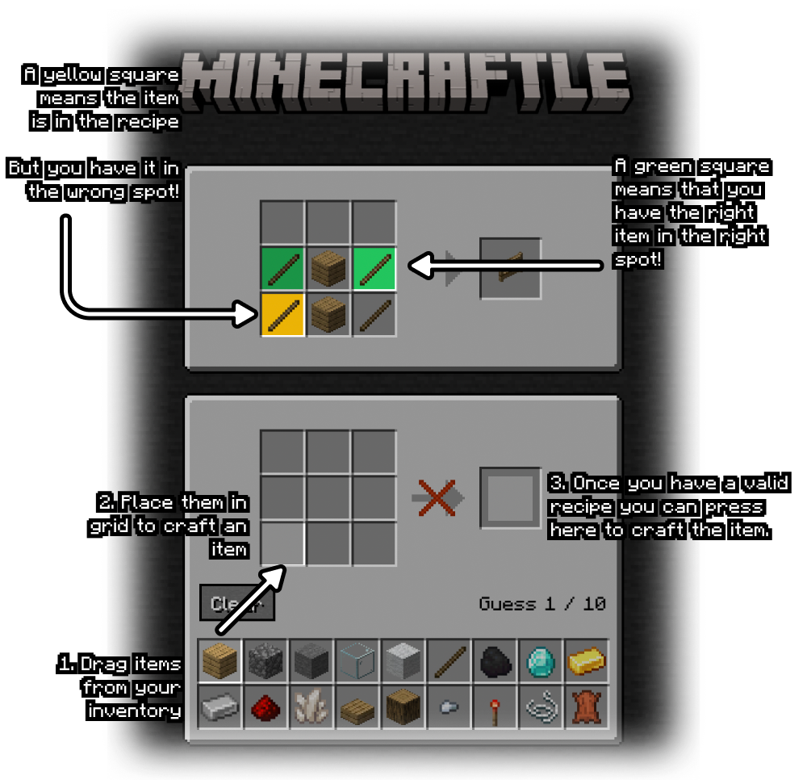

  

  <h1>
    Wordle with a Minecraft spin.
  </h1>

   
   

[Minecraftle](https://minecraftle2.vercel.app) is a Wordle-like game with a Minecraft-like interface. You craft items in a 3x3 grid and try and guess what the item is in 10 guesses. Everytime you submit an answer your shown the items in their correct spots (marked in green), items that are apart of the recipe (marked in orange) and if the item doesn't appear in the recipe it stays greyed out.

  

